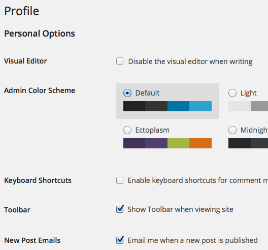
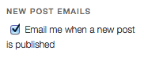

# Simple New Post Emails

> Allow site members to check a box and get new posts via email. Includes a widget.

   

## Description

Allow site members to check a box and get new posts via email. The checkbox appears on the user's profile, as well as an optional widget for your site. Works especially well for intranet sites.

### User profile option

### Widget in Twenty Eleven

## Requirements

* [WordPress](http://wordpress.org) 3.0+

## Installation

Simple New Post Emails is most easily installed automatically via the Plugins tab in your dashboard. If other WordPress emails do not send from your installation, neither will these.

## Frequently Asked Questions

### Where are all the configuration options?

The premise of this plugin is to keep things as simple as possible, particularly in the UI and UX. There are many other great plugins available that provide more functionality (typically with the cost of a more complex user experience), as well as email newsletter services. Some configuration is possible via hooks. If a hook isn't available to accomplish what you need, please [open an issue on GitHub](https://github.com/10up/simple-new-post-emails/issues).

## Support Level

**Archived:** This project is no longer maintained by 10up. We are no longer responding to Issues or Pull Requests unless they relate to security concerns. We encourage interested developers to fork this project and make it their own!

## Changelog

A complete listing of all notable changes to Simple New Post Emails are documented in [CHANGELOG.md](https://github.com/10up/simple-new-post-emails/blob/develop/CHANGELOG.md).

## Contributing

Please read [CODE_OF_CONDUCT.md](https://github.com/10up/simple-new-post-emails/blob/develop/CODE_OF_CONDUCT.md) for details on our code of conduct, [CONTRIBUTING.md](https://github.com/10up/simple-new-post-emails/blob/develop/CONTRIBUTING.md) for details on the process for submitting pull requests to us, and [CREDITS.md](https://github.com/10up/simple-new-post-emails/blob/develop/CREDITS.md) for a listing of maintainers of, contributors to, and libraries used by Simple New Post Emails.

## Like what you see?

